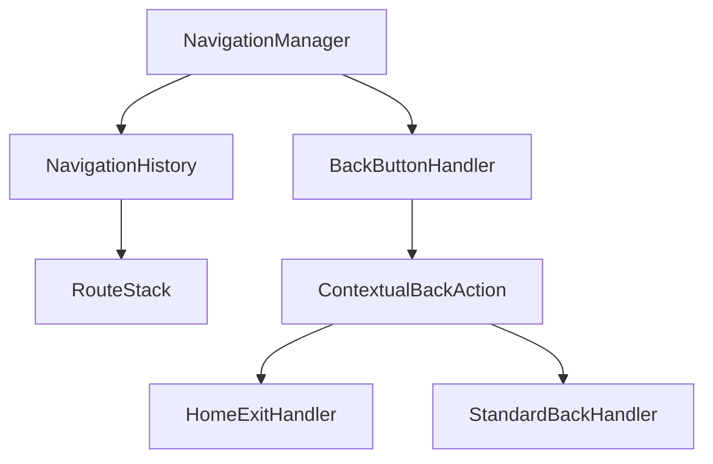
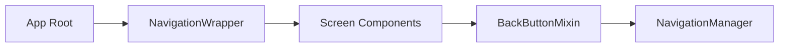

# Design Document

## Overview

현재 Flutter 앱에서 뒤로가기 버튼 처리가 일관되지 않고 사용자 친화적이지 않은 문제를 해결하기 위한 설계입니다. GoRouter를 사용하는 앱에서 자연스러운 네비게이션 히스토리 관리와 일관된 뒤로가기 동작을 구현합니다.

### 현재 문제점 분석
- 모든 하위 화면에서 뒤로가기 시 홈으로만 이동 (`context.go('/')`)
- PopScope의 `canPop: false` 설정으로 기본 뒤로가기 동작 차단
- 네비게이션 히스토리가 제대로 관리되지 않음
- 홈 화면에서만 앱 종료 확인 로직 존재

## Architecture

### 1. Navigation Management Layer
네비게이션 상태와 히스토리를 중앙에서 관리하는 계층을 구성합니다.



### 2. Component Structure


## Components and Interfaces

### 1. NavigationManager
네비게이션 상태를 관리하는 중앙 관리자입니다.

**책임:**
- 네비게이션 히스토리 추적
- 뒤로가기 동작 결정
- 컨텍스트별 뒤로가기 처리

**주요 메서드:**
- `handleBackNavigation(BuildContext context)`: 뒤로가기 처리
- `canNavigateBack()`: 뒤로가기 가능 여부 확인
- `updateNavigationHistory(String route)`: 히스토리 업데이트

### 2. BackButtonMixin
화면별 뒤로가기 동작을 표준화하는 믹스인입니다.

**기능:**
- PopScope 설정 표준화
- 뒤로가기 콜백 처리
- 화면별 커스텀 동작 지원

### 3. NavigationWrapper
앱 전체의 네비게이션을 감싸는 래퍼 위젯입니다.

**기능:**
- GoRouter 설정 관리
- 전역 네비게이션 상태 제공
- 뒤로가기 이벤트 감지

### 4. HomeExitHandler
홈 화면에서의 앱 종료 처리를 담당합니다.

**기능:**
- 더블 탭 종료 로직
- 종료 확인 스낵바 표시
- 타이머 기반 상태 관리

## Data Models

### NavigationState
```dart
class NavigationState {
  final List<String> routeHistory;
  final String currentRoute;
  final DateTime? lastBackPressTime;
  final bool canExit;
}
```

### BackNavigationResult
```dart
enum BackNavigationAction {
  pop,           // 이전 화면으로 이동
  goHome,        // 홈으로 이동
  showExitDialog, // 종료 확인
  exit           // 앱 종료
}

class BackNavigationResult {
  final BackNavigationAction action;
  final String? targetRoute;
  final bool handled;
}
```

## Error Handling

### 1. Navigation Errors
- **Route Not Found**: 기본 홈 라우트로 폴백
- **Invalid History**: 히스토리 재구성 또는 초기화
- **Context Issues**: 안전한 컨텍스트 확인 후 처리

### 2. State Management Errors
- **Provider Errors**: 기본값으로 폴백
- **Memory Issues**: 히스토리 크기 제한 및 정리

### 3. Platform-Specific Handling
- **Android Back Button**: 시스템 뒤로가기 이벤트 처리
- **iOS Swipe Back**: 제스처 기반 네비게이션 지원

## Testing Strategy

### 1. Unit Tests
- NavigationManager 로직 테스트
- BackButtonMixin 동작 테스트
- 히스토리 관리 테스트

### 2. Widget Tests
- PopScope 동작 테스트
- 뒤로가기 버튼 상호작용 테스트
- 스낵바 표시 테스트

### 3. Integration Tests
- 전체 네비게이션 플로우 테스트
- 다양한 화면 간 이동 시나리오
- 앱 종료 플로우 테스트

## Implementation Details

### 1. GoRouter Configuration
기존 GoRouter 설정을 개선하여 자연스러운 네비게이션을 지원합니다.

**변경사항:**
- `canPop: false` 제거
- 적절한 부모-자식 라우트 관계 설정
- 네비게이션 히스토리 추적

### 2. PopScope Standardization
모든 화면에서 일관된 PopScope 사용을 위한 표준화를 진행합니다.

**표준 구조:**
```dart
PopScope(
  canPop: navigationManager.canNavigateBack(),
  onPopInvokedWithResult: (didPop, result) {
    if (!didPop) {
      navigationManager.handleBackNavigation(context);
    }
  },
  child: ScreenContent(),
)
```

### 3. Route Hierarchy
명확한 라우트 계층 구조를 설정합니다.

```
/ (Home)
├── /exercises (Exercise List)
│   └── /add-exercise (Add Exercise)
├── /exercise-record (Exercise Record)
├── /weight-record (Weight Record)
├── /statistics (Statistics)
└── /export (Export)
```

### 4. Memory Management
네비게이션 히스토리의 메모리 사용량을 관리합니다.

- 히스토리 최대 크기 제한 (예: 20개)
- 오래된 항목 자동 정리
- 메모리 효율적인 데이터 구조 사용

### 5. Performance Considerations
- 뒤로가기 처리 시 지연 최소화
- 불필요한 리빌드 방지
- 효율적인 상태 관리

## Security Considerations

### 1. Route Validation
- 유효하지 않은 라우트 접근 방지
- 권한 기반 네비게이션 제어

### 2. State Protection
- 네비게이션 상태 무결성 보장
- 외부 조작 방지

## Accessibility

### 1. Screen Reader Support
- 네비게이션 변경 시 적절한 안내
- 뒤로가기 동작 설명

### 2. Keyboard Navigation
- 키보드 단축키 지원
- 포커스 관리

## Platform Compatibility

### 1. Android
- 시스템 뒤로가기 버튼 처리
- Material Design 가이드라인 준수

### 2. iOS
- 스와이프 제스처 지원
- Human Interface Guidelines 준수

### 3. Web
- 브라우저 뒤로가기 버튼 동기화
- URL 히스토리 관리

## Migration Strategy

### 1. 단계별 적용
1. NavigationManager 구현
2. BackButtonMixin 생성
3. 홈 화면 적용
4. 다른 화면들 순차 적용

### 2. 호환성 유지
- 기존 네비게이션 코드와의 호환성
- 점진적 마이그레이션 지원

### 3. 테스트 및 검증
- 각 단계별 테스트
- 사용자 피드백 수집
- 성능 모니터링